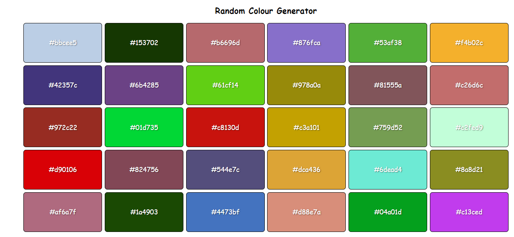

# random-colour-generator

## Description
The Random Colour Generator Web App is a simple and fun application designed to generate multiple random colours and codes with JavaScript. Built with HTML, CSS and JavaScript. Upon refreshing the page, the colors and codes change randomly for up to 30 color containers. The web app is also designed to be responsive, adapting to different screen sizes. It displays the colors in four columns on larger screens, then decreases to three, two and ultimately one column for smaller screens. This provides a seamless user experience on any device.

## Prerequisites
N/A

## Features
* Display the color in a visual box.
* Show the hex code of the generated color.
* Responsive design for mobile and desktop devices.

## Technologies Used
Built with:
* HTML
* CSS
* JavaScript

## Installation
N/A

## Usage
* Open the Random Colour Generator web application in your browser.
* View the generated colour displayed in the color box.
* Use the generated colours and hex codes in your design or development projects.

## Project Link
Application can can be viewed here: 
* [Live](https://yvonnesarah.github.io/random-colour-generator/)

* [Repository](https://github.com/yvonnesarah/random-colour-generator)

## Screenshot
Random Colour Generator

## Credit
N/A

## Licence
Please refer to the LICENSE in the repo.
