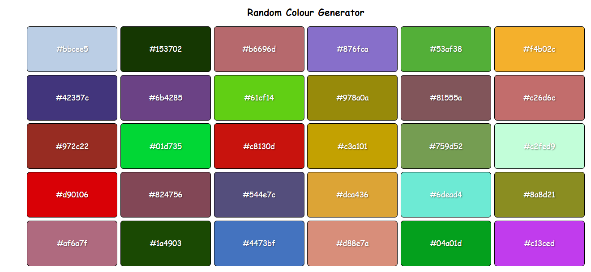

# random-colour-generator

## 📌 Description
The Random Colour Generator is a simple, fun, and interactive web app that generates random colors and their corresponding hex codes. The app is built using HTML, CSS, and JavaScript. Upon refreshing the page, up to 30 color containers are displayed with randomly generated colors and their hex codes. The app also features a responsive design that adapts to different screen sizes. On larger screens, it shows the colors in four columns, and as the screen size decreases, it adjusts to three, two, or even one column for smaller devices. This ensures a smooth and enjoyable user experience across all devices.

## 🛠 Prerequisites
* 🌐 A modern web browser such as Chrome, Firefox, Safari, or Edge
* 📶 An active internet connection to access the live web app.

## 📋 Features
* Color Display: The generated color is shown in a visual box, making it easy to identify.
* Hex Code: Each color’s hex code is displayed alongside the color itself.
* Responsive Layout: The web app adapts to various screen sizes, displaying the colors in a grid format with dynamic column adjustments.
* Refreshing Colors: Every page refresh generates a new set of random colors.

## 💻 Technologies Used
This project was built using:
* HTML
* CSS
* JavaScript

## 🚀 Installation
The web app is ready to use directly from the live URL. No installation is required.

## 📚 Usage
1. Open the Random Colour Generator web application in your browser.
2. Upon loading, the app will display a set of randomly generated colors with their hex codes.
3. Refresh the page to generate a new set of random colors and codes.
4. Use the color codes in your design or development projects for inspiration or practical implementation.

## 🔗 Live Demo & Repository
Application can be viewed here:
* [Live](https://yvonnesarah.github.io/random-colour-generator/)

* [Repository](https://github.com/yvonnesarah/random-colour-generator)

## 🖼 Screenshot
Random Colour Generator

## 🚀 Future Improvements
* 🌈 Custom Number of Colors - Allow users to select how many colors they want to generate.
* 🎨 Color Formats - Include RGB and HSL values alongside hex codes.
* 🔍 Copy-to-Clipboard - Enable users to click a color to copy its hex code easily.
* 🖌️ Save Favorites - Allow users to save or download favorite colors.
* 🌓 Dark/Light Mode - Add theme options for better accessibility.
* 📱 Mobile Enhancements - Further optimize UI and touch interactions for smaller screens.

## 👥 Credit
Developed by Yvonne Adedeji.

## 📜 License
This project is open-source. For licensing details, please refer to the LICENSE file in the repository.

## 📬 Contact
You can reach me at 📧 yvonneadedeji.sarah@gmail.com.
